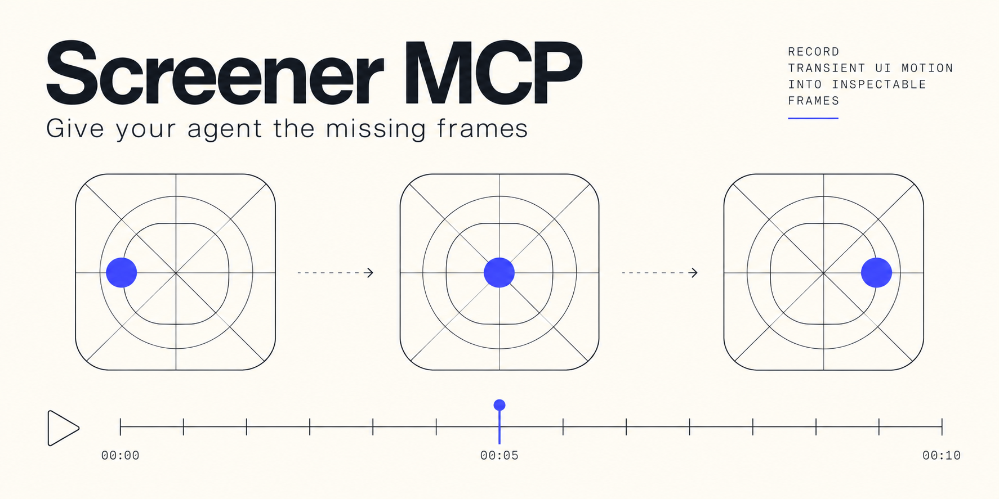

# Screener



**The animation is over. Your agent is still taking a screenshot.**

A menu flashes, a sheet jumps, a loading state disappears. By the time your coding
agent looks, the UI has moved on — and you are left describing what you saw.

Screener gives your agent a visual history of your **iOS or macOS app**: captured
frames and named events on a timeline. Record a short reproduction, then let the
agent browse a contact sheet, open individual frames, and relate them to your code
through a local, read-only **MCP server**.

**Reproduce → capture → inspect with your agent.** No cloud service or account.

> **Early alpha · [v0.1.0-alpha.2](https://github.com/SoundBlaster/Screener/releases/tag/v0.1.0-alpha.2).**
> Screener records sampled keyframes, not video. It helps investigate transient UI,
> but sampling can miss a fast transition and hierarchy capture may omit intermediate
> animation states. It does not guarantee every animation frame or exact system glass.

## Quick start: iOS Simulator → your agent

You need a Mac, Xcode with Swift 6.1 or later, an iOS 16+ app, and an MCP client
that can display images. This example uses UIKit; SwiftUI apps can capture their
hosting window with the same adapter.

### 1. Add the package

In Xcode, choose **File → Add Package Dependencies**, enter:

```text
https://github.com/SoundBlaster/Screener
```

Select **Exact Version → 0.1.0-alpha.2**, then add **ScreenerKit** to your app target.
For a `Package.swift` project, use:

```swift
// In dependencies:
.package(url: "https://github.com/SoundBlaster/Screener", exact: "0.1.0-alpha.2")
// In your app target's dependencies:
.product(name: "ScreenerKit", package: "Screener")
```

### 2. Record a short reproduction

Add this helper to your app. It captures 20 window keyframes into a local `.vtrace`
bundle and closes the session, including when capture fails.

```swift
#if DEBUG
import UIKit
import ScreenerKit

@MainActor
func recordUI(in window: UIWindow) async throws -> URL {
    let recorder = Screener()
    let trace = try await recorder.startSession(
        name: "ui-reproduction",
        appBundleID: Bundle.main.bundleIdentifier ?? "example.app",
        tracesDirectory: URL.documentsDirectory.appending(path: "ScreenerTraces")
    )
    let capture = ScreenerCaptureSession(screener: recorder)
    do {
        try await recorder.mark("Reproduction.started")
        for index in 0..<20 {
            try await capture.capture(
                from: UIKitCaptureSource(view: window),
                reason: "sample-\(index)"
            )
            try await Task.sleep(for: .milliseconds(100))
        }
        try await recorder.stopSession()
        return trace
    } catch {
        try? await recorder.stopSession()
        throw error
    }
}
#endif
```

Call it from a Debug button in your `UIViewController`, then reproduce the issue
while it records:

```swift
#if DEBUG
Task { @MainActor in
    guard let window = self.view.window else { return }
    do {
        let trace = try await recordUI(in: window)
        print("Trace ready: \(trace.path)")
    } catch {
        print("Capture failed: \(error)")
    }
}
#endif
```

The 100 ms sleep is a pause **between** captures, not a frame-rate promise: rendering
and PNG writes add time. Adjust the sample count and pause for your reproduction.
Use `recorder.mark("Menu.opened")` in your own recording flow to label an event.

### 3. Copy the trace to your Mac

After **Trace ready** appears, find your booted Simulator's UUID:

```sh
xcrun simctl list devices booted
```

Replace `SIMULATOR_UUID` and `YOUR_APP_BUNDLE_ID` below. The bundle ID is in your
app target's **Signing & Capabilities** settings.

```sh
APP_DATA=$(xcrun simctl get_app_container SIMULATOR_UUID YOUR_APP_BUNDLE_ID data)
mkdir -p "$HOME/ScreenerTraces"
cp -R "$APP_DATA/Documents/ScreenerTraces/." "$HOME/ScreenerTraces/"
```

### 4. Connect the MCP server

In a separate Terminal, build the matching release on your Mac:

```sh
git clone --branch v0.1.0-alpha.2 https://github.com/SoundBlaster/Screener.git
cd Screener
swift build -c release --product screener-mcp
SCREENER_BIN="$(swift build -c release --show-bin-path)/screener-mcp"
echo "$SCREENER_BIN"
```

For **Codex CLI**, register that binary:

```sh
codex mcp add screener -- "$SCREENER_BIN" --traces-dir "$HOME/ScreenerTraces"
```

Start a new agent session to load the server. For another MCP client, use its
stdio-server settings with the absolute path printed above and your trace directory:

```json
{
  "mcpServers": {
    "screener": {
      "command": "/absolute/path/to/screener-mcp",
      "args": ["--traces-dir", "/Users/you/ScreenerTraces"]
    }
  }
}
```

### 5. Ask your agent to inspect what happened

```text
Use Screener to inspect my latest ui-reproduction session.
Read its timeline and contact sheet, then open the relevant individual frames.
Explain the visible UI changes and help locate the cause in my code.
Distinguish what the captured frames show from anything they may have missed.
```

| MCP tool | What your agent gets |
| --- | --- |
| `screener.sessions` | Available recording sessions |
| `screener.timeline` | Ordered markers and frame records |
| `screener.contact_sheet` | A numbered grid of captured frames |
| `screener.frame` | An individual image by session and record ID |

The server reads local trace files. It does not drive your app or start recordings;
those happen through the app-side SDK. Your MCP client's model and data-handling
settings determine where images go after the client reads them.

## Choose the right capture

- **UIKit / AppKit:** capture an existing window or view. UIKit uses its current
  display scale. Useful for layout, state changes, and visual history; blur, glass,
  overlays, and GPU content can differ from the screen.
- **SwiftUI:** render an explicit subtree, or capture its hosting window through
  UIKit / AppKit.
- **Simulator materials:** pair the trace with `simctl` screenshots to check glass.
- **Experimental ScreenCaptureKit:** opt-in capture on a physical iOS 27 device
  with recording permission. Its roughly one-second sampling targets materials
  and stable states; it is not a fast-animation backend.

See the [capture and MCP guide](docs/capture-guide.md) for backend examples,
physical-device constraints, pagination, storage, and architecture.
The [UIKit fixture](Examples/UIKitCaptureFixture/README.md) and
[Air session report](docs/validation/screen-capture-session-2026-10-09/README.md)
show what has actually been checked.

## Give your agent the workflow

The optional [Screener skill](.agents/skills/screener-visual-trace/SKILL.md) teaches
Codex how to choose a capture backend and verify the resulting evidence.
Install the skills-only plugin:

```sh
codex plugin marketplace add SoundBlaster/Screener
codex plugin add screener@screener-local
```

Then ask it to use `$screener-visual-trace`. The plugin does not install the SDK or
register the MCP server; complete those steps above. See the
[plugin guide](docs/capture-guide.md#codex-skill-and-plugin) for project-local use.

## Try the macOS demo or contribute

```sh
swift run --package-path Examples/ScreenerFixture
```

Choose **Start recording**, advance the fixture state, capture frames, and stop.
To inspect these traces, point the MCP server at
`$HOME/Library/Caches/ScreenerFixture/Traces`.

Run package tests with `swift test`. See the [product scope](docs/PRD.md),
[architecture decisions](docs/adr), and [changelog](CHANGELOG.md).
Screener is open source under the [MIT License](LICENSE).
