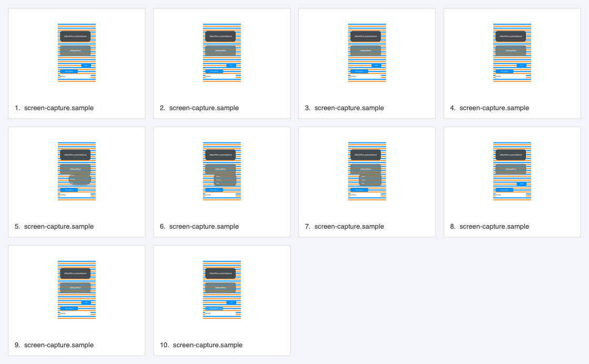
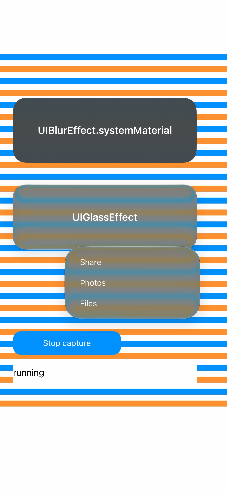
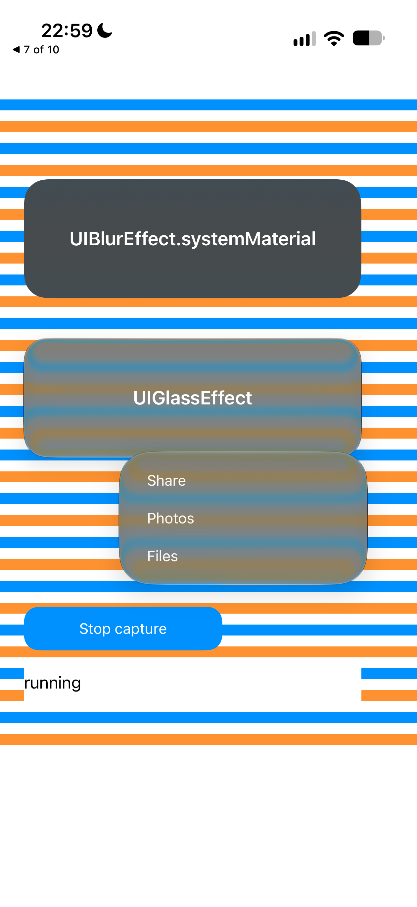

# ScreenCaptureKit SDK session — physical Air, 2026-10-09

The opt-in `ScreenerKit.ScreenCaptureKitSession` recorded current-app compositor
frames directly into `.vtrace`. The separate research PNG sink was not used.
Screen recording permission was granted manually; XCUITest never tapped approval.

## Result

- Device: physical iPhone Air, UDID `00008150-000208290280401C`, iOS 27.0 (`24A435`).
- Build: Xcode 27.1, iPhoneOS 27.1 SDK, Swift 6; app deployment target remains iOS 16.
- Session: `33065C62-8859-4F9E-86C6-48213EC949D6`, started 19:59:30.995 UTC.
- Ten PNG keyframes, all **1260 × 2736**, scale **3.0**, RGBA8 sRGB converted from
  `420f` (`875704422`) source samples. Source PTS is retained separately from trace time.
- Fifteen contiguous timeline records (0–14), ending in `screen-capture.stopped`
  followed by `sessionEnded`; no fixture error file was produced.
- App PID `3653` remained stable through base → Save menu → stopped.
- Independent visual inspection found matching glass/blur geometry and readable
  Share/Photos/Files in the trace and system menu screenshot. This is a visual
  observation, not a new pixel-error measurement. Current-app capture excludes
  the system status bar/back breadcrumb visible in the system screenshot.
- A real stdio MCP round trip read sessions, all 15 timeline records, one full PNG,
  and a contact sheet containing all ten frames.

| SDK trace menu | Independent system screenshot |
| --- | --- |
|  |  |

The preserved manifest/timeline and selected PNGs are evidence, not a complete
replayable bundle: the full ten-frame `.vtrace` and raw xcresults remain locally
under the primary checkout's `.build/session-air-data` and `.build/session-air.xcresult`.

## Validation

- Package tests: **31 passed** (11 ScreenerKit, 11 MCP, 9 core).
- Fresh Air capture xcresult: **1 passed**, 0 failed/skipped; checks running,
  menu actions, explicit stop, and finished UI.
- Fresh Air lifecycle xcresult: **2 passed**, 0 failed/skipped; checks terminal
  idempotent stop before start, rejection of reuse, and missing active trace
  before any permission request.
- Initial lifecycle build failed because Swift Testing rejects availability on a
  suite; fixed with runtime availability guards. A subsequent broad local test
  attempt was interrupted by disk exhaustion and is not counted as a pass.
  The final targeted lifecycle run passed after clearing rebuildable compiler cache.

The SDK implementation keeps one latest pending complete sample and one in-flight
write, converts on the stream queue, and serializes PNG persistence through Screener.
Stop awaits startup/stream stop, the publisher, and a final pending-frame drain
before the fixture closes its trace. Source metadata cannot overwrite actual PNG
width/height/scale/encoding; package tests cover this and bounded final-frame handoff.

## Reproduction and limits

Use the fixture's `--screencapturekit-trace` flag, or the gated Air UI scheme with
`TEST_RUNNER_SCREENER_AIR_RESEARCH=1`, `TEST_RUNNER_SCREENER_AIR_SDK_TRACE=1`, and
`TEST_RUNNER_SCREENER_AIR_PHASE=capture`. Confirm recording manually once, then
reuse that session for base/menu and stop. Copy `Documents/ScreenCaptureTraces`
after completion and open the named trace with Screener MCP.

The type is experimental and device-only on iOS 27. The Simulator SDK does not
provide this framework. Sampling is roughly once per second plus a final drain;
it does not establish transition-rate or performance coverage. Rotation,
background/interruption, timeout during permission, concurrent stop during stream
startup, and system rejection were not exercised in this SDK capture run.
The last frame precedes completion; completion is established by the final timeline
and the separate stopped system screenshot, not by inventing a final captured state.
